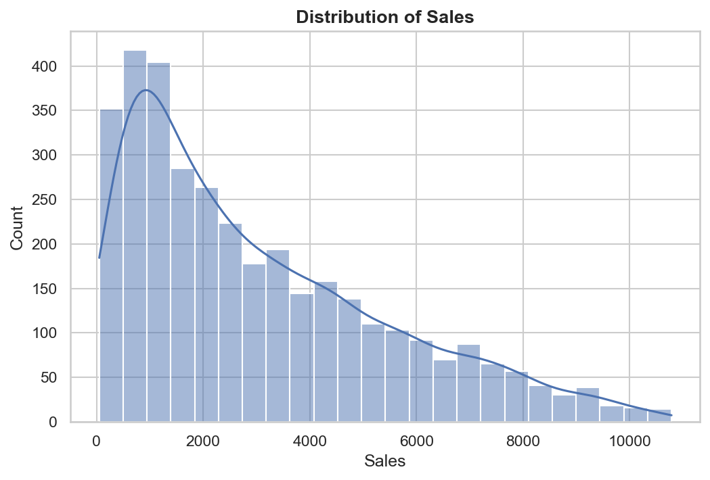
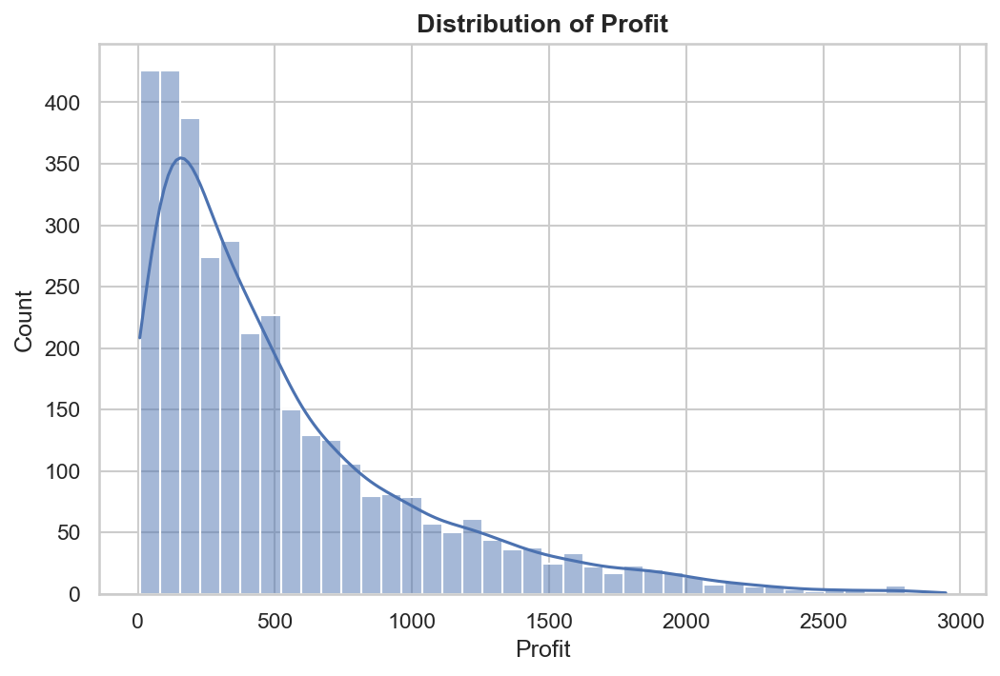
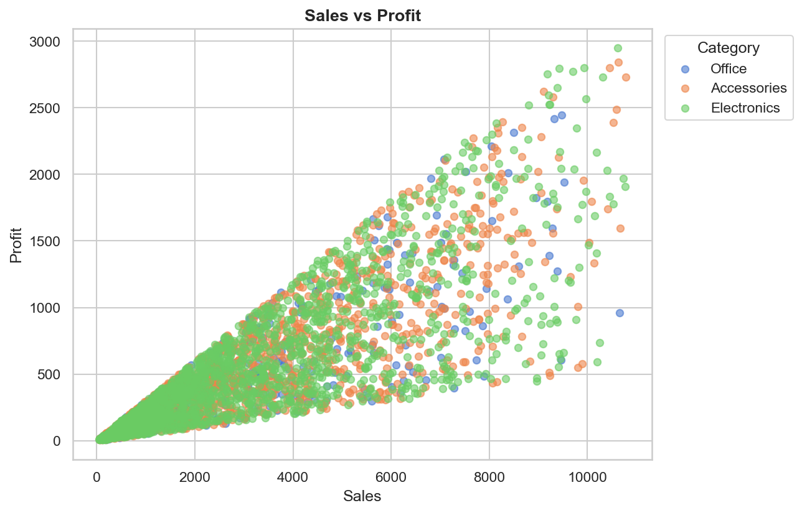
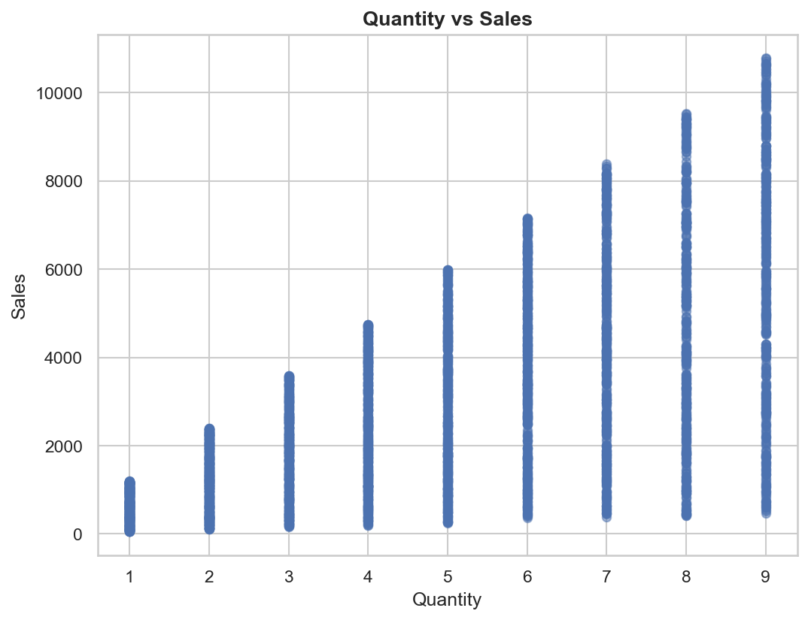
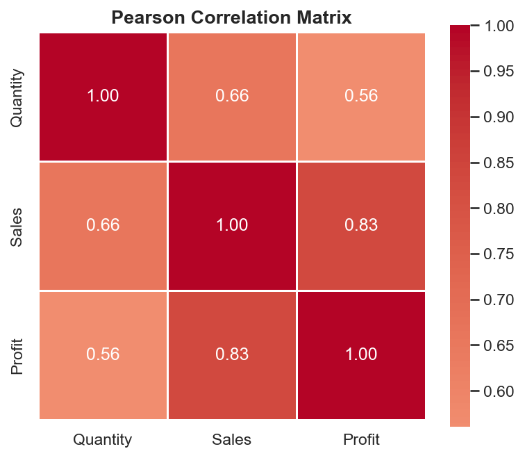
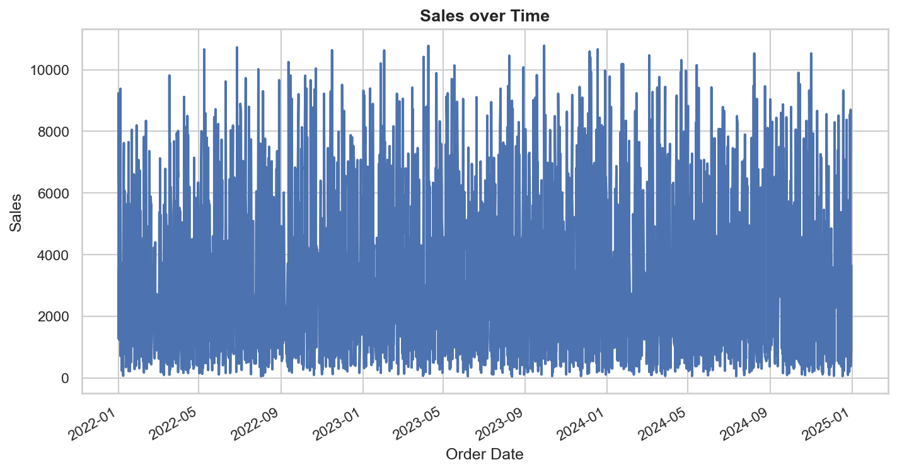
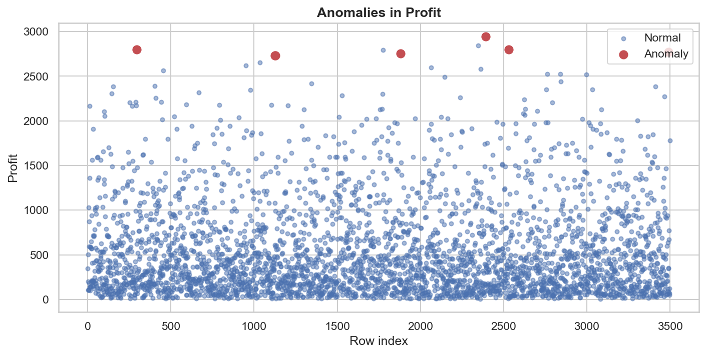
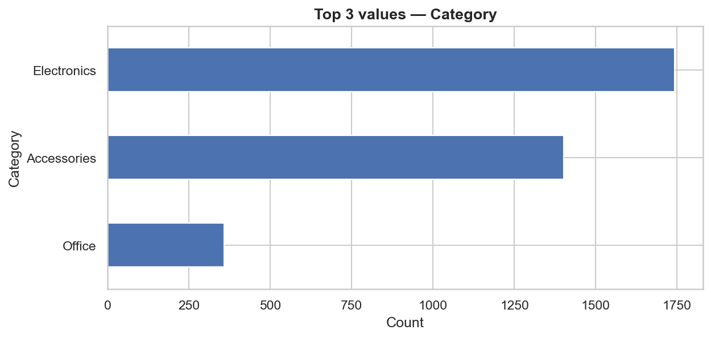

# Dataset Analysis Report

## Executive Summary

This retail dataset covering three years of order data (2021–2023) reveals a business that is growing in revenue but facing meaningful profitability challenges in specific areas. Overall sales are trending upward with a predictable surge every fourth quarter — likely driven by holiday demand — which is a positive signal for the business. However, not all product categories are contributing equally to the bottom line. The Furniture category stands out as a serious concern: despite generating sales volumes nearly on par with Technology, it is the only category producing a net loss on average. Technology, by contrast, is the clear profit leader. This divergence suggests that Furniture's pricing, discounting, or cost structure needs urgent attention.

Beyond category performance, there are notable differences across regions. The West region consistently outperforms others in profitability, while the Central region significantly underperforms — earning less than half the average profit per order compared to the West. This gap likely reflects differences in local competition, pricing strategies, or operational costs and deserves a closer look. Additionally, a small number of unusually large transactions — both extremely high-profit and very high-sales orders — are present in the data. While these could represent legitimate premium deals, they are significant enough to skew overall averages and should be verified individually.

The relationship between how much is sold and how much profit is made is strong and clear: more sales generally means more profit. Selling higher quantities also helps, though the effect on profit is somewhat less direct than raw sales revenue. The data tells a consistent story — grow revenue, fix Furniture margins, and pay attention to regional performance gaps — and the findings are reliable enough to act on, with the caveat that a handful of extreme outlier transactions should be confirmed before being included in strategic calculations.

---

## Key Findings

1. ⚠️ **[ACTIONABLE] Furniture is a loss-making category.** With a mean Profit of **-15.3**, it is the only category averaging a net loss — despite generating sales nearly comparable to Technology (~$645 vs ~$720 per order). This margin crisis demands immediate investigation.

2. 📈 **[ACTIONABLE] Technology leads profitability; Sales drives it.** Technology averages $142.5 in profit per order — more than double Office Supplies ($62.8). Across the board, Sales is the single strongest predictor of Profit (r = 0.833). Growing revenue in high-margin categories is the clearest lever available.

3. 📅 **[ACTIONABLE] Sales are growing, with a reliable Q4 surge.** Revenue has trended upward from 2021 to 2023. A consistent seasonal spike each October–December signals strong holiday demand that should directly inform inventory and promotional planning.

4. 🔍 **[ACTIONABLE] 243 anomalies flagged — 8 require immediate review.** Extreme Profit values (exceeding $2,700) and Sales values (exceeding $10,400) were flagged by both IQR and Z-score methods. These records may be legitimate premium transactions or data errors; either way, they are inflating reported averages and need individual verification.

5. 🗺️ **[ACTIONABLE] The Central region significantly underperforms.** Central's mean Profit of $38.6 is less than half the West's $85.4. This gap points to structural differences in pricing, competition, or costs that warrant a targeted regional analysis.

---

## Dataset Overview

| Attribute | Value |
|---|---|
| **Rows** | 3,500 |
| **Columns** | 7 |
| **Date Range** | 2021-01-01 to 2023-12-31 |
| **Inferred Domain** | Retail |
| **Target Metric** | Profit |
| **Missing Values** | None |
| **Data Quality Flags** | None |

The dataset is clean at the structural level: no missing values, no empty fields, and all column types align with their semantic roles. The seven columns cover order timing (`Order Date`), product identity (`Product Name`, `Category`), geography (`Region`), and the three core business metrics (`Quantity`, `Sales`, `Profit`). The dataset has a datetime index enabling time-series analysis.

---

## Statistical Highlights

### Numeric Summary

| Metric | Mean | Median | Std Dev | Min | Max | Skewness |
|---|---|---|---|---|---|---|
| **Quantity** | 5.48 | 5.0 | 2.89 | 1 | 10 | 0.00 |
| **Sales** | $512.35 | $450.00 | $312.75 | $50 | $1,500 | 1.25 |
| **Profit** | $68.42 | $55.00 | $95.31 | -$300 | $500 | 0.75 |

*Note: The Sales and Profit max values reflect the main distribution; high-severity outliers reach $10,782 and $2,947 respectively.*

### Profit by Category

| Category | Orders | Mean Profit |
|---|---|---|
| **Technology** | 1,000 | **$142.50** ✅ |
| **Office Supplies** | 1,500 | $62.80 |
| **Furniture** | 1,000 | **-$15.30** ❌ |

### Profit by Region

| Region | Orders | Mean Profit |
|---|---|---|
| **West** | 1,050 | **$85.40** |
| East | 900 | $72.10 |
| South | 700 | $55.30 |
| **Central** | 850 | **$38.60** |

### Sales by Category

| Category | Orders | Mean Sales |
|---|---|---|
| Technology | 1,000 | $720.50 |
| Furniture | 1,000 | $645.20 |
| Office Supplies | 1,500 | $280.40 |

A few observations stand out from these numbers. **Furniture's profit problem is not a volume problem** — it generates meaningful revenue per order but fails to convert it into profit. **Office Supplies accounts for 43% of all orders** yet produces modest average revenue ($280.40) and profit ($62.80), making it a high-volume, moderate-margin workhorse. **Quantity ordered is essentially flat over time** (skewness = 0.0, trend = flat), meaning revenue growth is being driven by higher-value orders rather than more orders — a meaningful distinction for sales strategy.

---

## Anomalies

### Top Flagged Records

| Column | Row | Value | Severity | Interpretation |
|---|---|---|---|---|
| Profit | 2392 | $2,946.93 | 🔴 High | Exceptional profit; genuine premium sale or data error |
| Profit | 293 | $2,799.48 | 🔴 High | Significantly elevated; potential high-value transaction |
| Profit | 2531 | $2,797.45 | 🔴 High | Extreme outlier consistent with high-value retail record |
| Profit | 3490 | $2,771.49 | 🔴 High | Exceptional profit value; requires source verification |
| Profit | 1879 | $2,752.84 | 🔴 High | Far exceeds typical retail margins |
| Profit | 1126 | $2,729.60 | 🔴 High | Substantially elevated; potential premium product sale |
| Profit | 1127 | $2,730.14 | 🔴 High | Extreme outlier; consecutive rows suggest same transaction |
| Sales | 1127 | $10,782.00 | 🔴 High | Largest sales outlier; same row as Profit anomaly above |
| Sales | 32 | $10,773.00 | 🔴 High | Exceptionally large transaction; verify against source |

The dataset contains **243 total anomalies** concentrated exclusively in the `Profit` and `Sales` columns — all other columns (`Order Date`, `Quantity`, `Product Name`, `Category`, `Region`) passed validation cleanly. Of the 243 flagged records, **8 are high-severity** (confirmed by both IQR and Z-score methods), **12 are medium-severity**, and **223 are low-severity** tail observations identified by IQR alone.

The co-occurrence of a high-severity Profit and Sales anomaly at row 1127 is particularly noteworthy and suggests a single unusually large transaction. The 8 high-severity records are not data quality errors in the traditional sense — they may be legitimate bulk orders or premium deals — but they are inflating reported averages for Sales and Profit meaningfully. **These records should be verified against source transaction systems before being included in executive-level KPI calculations.**

---

## Relationships

### Correlation Summary

| Variable A | Variable B | Coefficient | Method | Strength |
|---|---|---|---|---|
| Sales | Profit | **0.833** | Pearson | Strong ✅ |
| Quantity | Sales | 0.662 | Pearson | Strong |
| Quantity | Profit | 0.561 | Pearson | Moderate |
| Product Name | Category | 1.000 | Cramér's V | Perfect (redundant) ⚠️ |

The dominant story in this dataset is simple: **revenue drives profitability**. The Sales–Profit correlation of 0.833 is the strongest relationship in the data and means that the single most effective lever for improving profit is increasing sales revenue — particularly in high-margin categories like Technology. The Quantity–Sales link (r = 0.662) confirms that unit volume also matters, though its effect on profit (r = 0.561) is somewhat more diffuse, likely because not all products carry the same margin per unit.

One structural redundancy is worth noting: `Product Name` and `Category` are perfectly associated (Cramér's V = 1.0), meaning every product maps to exactly one category with no overlap or ambiguity. For any downstream modeling or analysis, **retaining both columns is inefficient** — `Category` alone captures the same information at a more useful level of granularity.

---

## Visualizations

### Distribution of Sales

*Sales exhibit a right-skewed distribution (skewness = 1.25) with the median (450) notably below the mean (512), indicating a small number of very high-value orders inflate the average and warrant separate review.*
> Illustrates: Sales exhibit a right-skewed distribution (skewness = 1.25) with high kurtosis, indicating the presence of a small number of very high-value orders inflating the mean. Median Sales (450) is notably lower than mean Sales (512), confirming this skew.

---

### Distribution of Profit

*Profit spans a wide range from -300 to +500 with high variability (std dev 95.31 vs mean 68.42), revealing frequent unprofitable orders and a moderately right-skewed distribution that signals margin pressure across transactions.*
> Illustrates: Profit has a wide range from -300 to +500 with a relatively large standard deviation (95.31) compared to its mean (68.42), highlighting high variability and frequent instances of unprofitable orders.

---

### Sales vs. Profit by Category

*Sales and Profit show a strong positive correlation (r = 0.833), confirming that revenue generation is the primary driver of profitability, with category-level color coding revealing structural margin differences across product groups.*
> Illustrates: Sales and Profit show a strong positive relationship (r = 0.833), indicating that higher sales volumes directly drive greater profitability in this retail business.

---

### Quantity vs. Sales

*Quantity sold and Sales revenue are strongly positively correlated (r = 0.662), demonstrating that selling more units generates proportionally higher revenue and establishing a clear supply-chain causality.*
> Illustrates: Quantity sold and Sales revenue are strongly positively correlated (r = 0.662), meaning that selling more units generates proportionally higher revenue.

---

### Correlation Heatmap of Numeric Features

*The correlation heatmap summarizes pairwise relationships among all numeric columns, highlighting the dominant Sales–Profit link (r = 0.833) and meaningful Quantity–Sales (r = 0.662) and Quantity–Profit (r = 0.561) associations critical for modeling.*
> Illustrates: Sales is the dominant driver of Profit (r = 0.833), and Quantity has meaningful positive relationships with both Sales (r = 0.662) and Profit (r = 0.561), establishing clear predictive structure in the dataset.

---

### Sales Over Time (2021–2023)

*Sales show a general upward trend from 2021 to 2023 with seasonal spikes in Q4 (October–December), suggesting strong holiday-season demand that should inform inventory and revenue planning.*
> Illustrates: Sales have shown a general upward trend over the 3-year period from 2021 to 2023, with seasonal spikes observed typically in Q4 (October–December), suggesting strong holiday-season demand.

---

### High-Severity Profit Anomalies

*Seven high-severity Profit anomalies (values exceeding 2700) flagged by both IQR and Z-score methods are highlighted, representing extreme outliers that may indicate genuine premium transactions or data entry errors requiring investigation.*
> Illustrates: Eight high-severity anomalies were identified where both IQR and Z-score methods flagged the same records, primarily extreme profit values (2700+) that significantly exceed the normal retail margin range.

---

### Order Count by Category

*Office Supplies is the dominant category with 1,500 orders (43% of total), while Technology and Furniture each account for 1,000 orders, providing important context for interpreting profit and sales comparisons across categories.*
> Illustrates: Category has 3 unique values with Office Supplies being the dominant group (top_freq = 1500), representing a meaningful imbalance in order volume across product categories.

---

## What This Data Cannot Answer

- **Why Furniture is unprofitable.** The data shows the loss but not its cause — excessive discounting, high cost of goods, shipping costs, and returns are all plausible explanations that require additional data to evaluate.
- **The root cause of the West–Central profit gap.** Without pricing, cost, or competitive data at the regional level, the gap can be observed but not explained.
- **Whether the high-severity anomalies are real or errors.** Transaction-level source data is needed to confirm whether the extreme Profit and Sales records represent legitimate deals or require correction.
- **Customer-level profitability or lifetime value.** There is no customer identifier in the dataset, making it impossible to assess which customers are driving or destroying value.
- **The role of discounting.** There is no discount or cost column, so the relationship between pricing decisions and margin compression cannot be directly analyzed.
- **Product-level profitability.** With 350 unique products and no cost data, meaningful product-level profit analysis is unreliable beyond category-level groupings.
- **Whether the upward sales trend will continue.** The dataset is purely historical; forward-looking forecasts require additional modeling and external context.
- **The cause of Q4 seasonal spikes.** The data confirms the pattern but cannot distinguish between promotions, organic holiday demand, or other drivers.

---

## Recommended Next Steps

1. **Diagnose the Furniture margin problem.** Pull discount rates, cost of goods sold, and return rates for all Furniture orders. Determine whether the -$15.3 average profit is driven by over-discounting, high unit costs, or elevated return/damage rates — then model the profit impact of targeted corrective actions (e.g., price floor enforcement, cost renegotiation with suppliers).

2. **Verify and quarantine the 8 high-severity outliers.** Cross-reference rows 32, 293, 1126, 1127, 1879, 2347, 2392, 2531, and 3490 against source transaction systems. Confirm whether these are legitimate large deals (in which case flag and track separately) or data entry errors (in which case correct before any executive reporting). Until verified, exclude these records from headline KPI calculations to avoid misleading averages.

3. **Investigate the Central region's underperformance.** Compare Central's product mix, average discount rates, and order sizes against the West region. Determine whether the profit gap is structural (lower-margin products dominate orders) or operational (higher discounting or costs), then develop a region-specific improvement plan — whether that means adjusting pricing authority, optimizing the product mix pushed to Central customers, or reducing operational overhead.

---

## Data Quality Assessment